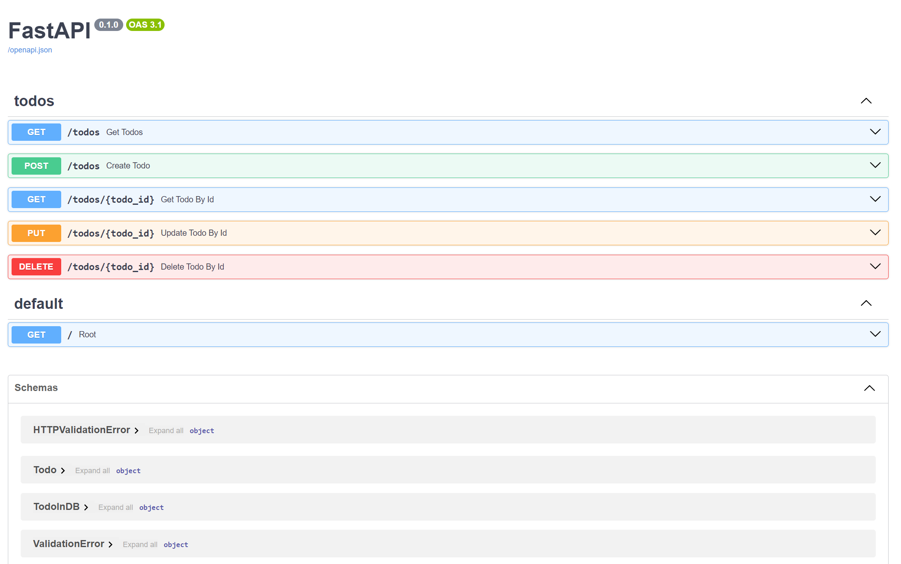

# Python FastAPI Starter

This branch includes a starter implementation of an auth API in Python FastAPI.

Access other branches to find more modular implementations of authentication and todo APIs:

- [main](https://github.com/afutofu/python-fastapi-starter): Both Auth and Todo API
- [rest-todo](https://github.com/afutofu/python-fastapi-starter/tree/rest-todo): Todo API

## Table of Contents

1. [Features](#features)
1. [Endpoints](#endpoints)
1. [Setup](#setup)
1. [Usage](#usage)
1. [Access OpenAPI](#access-openapi-ui)
1. [Authors](#authors)

## Features

- User registration
- User login
- User logout

## Endpoints

### Authentication

- `POST /auth/register` - Register a new user
- `POST /auth/token` - Login a user
- `POST /auth/logout` - Logout a user

## Setup

1. Clone the repository:

   ```bash
   git clone https://github.com/afutofu/python-fastapi-starter.git
   cd python-fastapi-starter
   ```

2. Install dependencies:

   ```bash
   pip install -r requirements.txt
   ```

3. Run the server:

   ```bash
    uvicorn folder.main:app --reload
   ```

## Usage

### Authentication

Register a user:

```bash
curl -X POST http://localhost:8000/auth/register -H "Content-Type: application/json" -d '{"username":"testuser", "password":"password123"}'
```

Login:

```bash
curl -X POST http://localhost:8000/auth/token -H "Content-Type: application/json" -d '{"username":"testuser", "password":"password123"}'

```

Logout user:

```bash
curl -X POST http://localhost:8000/auth/logout
```

## Access OpenAPI UI

Navigate to:

```bash
http://localhost:8000/docs
```



## Authors

- [Afuza](https://github.com/afutofu): Create and maintain repository
